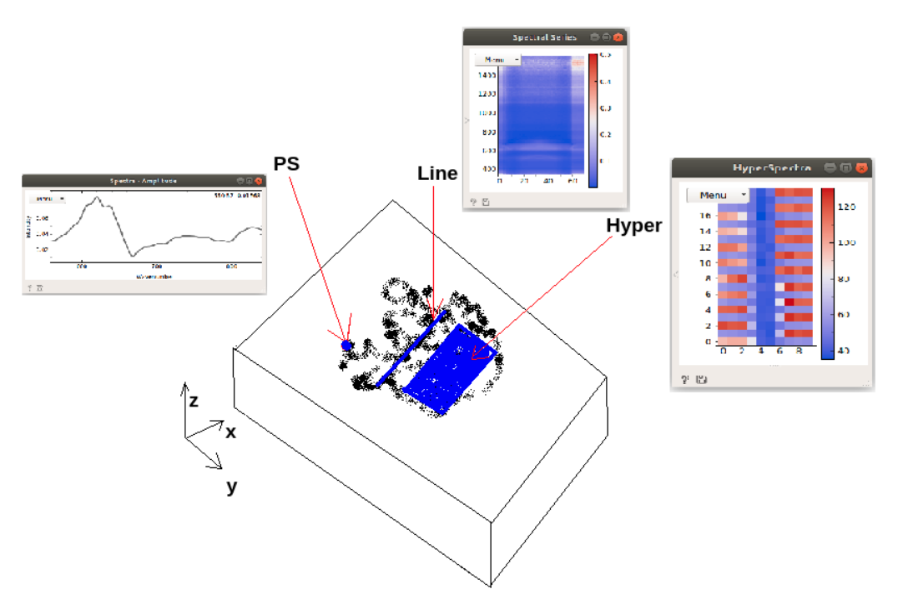

# Orange Workflows for s-SNOM

In this repository there is some examples about how to open and post-process files from neaSNOM microscope.

The experimental data used in these examples was courtesy of FERES (2021).

In this equipament is possible to generate 3 main types of data, with a better descrition of this types in this respective folders.

 - [Point Spectrum](point-spectrum/README.md):

	This is just a spectrum measured in just on position.

	This data has a full spectrum data, wavenumber approximately 600 cm-1 up to 2000 cm-1, but in only one pixel.

 - [Linescan](linescan/README.md):

 	In this case, a full spectrum of each pixel along a path choose is during the experiment.

 - [Hyperspectral Image](hyper/README.md):

 	In the last type is a full spectrum on each pixel inside an area.

References:

 -  'F. H. Feres, R. A. Mayer, L. Wehmeier, F. C. B. Maia, E. R. Viana, A. Malachias, H. A. Bechtel, J. M. Klopf, L. M. Eng, S. C. Kehr, J. C. González, R. O. Freitas, I. D. Barcelos, Nat. Commun. 2021, 12, 1995. DOI: [10.1038/s41467-021-22209-w](https://doi.org/10.1038/s41467-021-22209-w).'